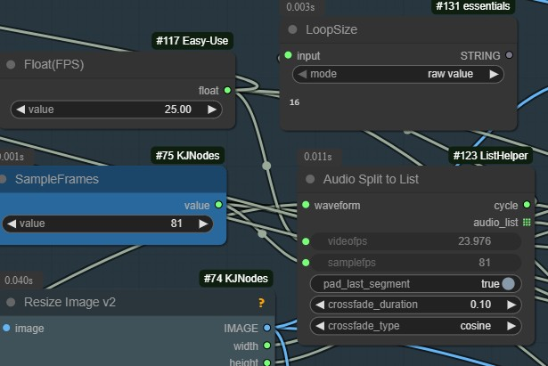

# ListHelper Nodes Collection

[中文版本](#中文版本) | [English Version](#english-version)

---

## English Version

### Overview

The **ListHelper** collection is a comprehensive set of custom nodes for ComfyUI that provides powerful list manipulation capabilities. This collection includes audio processing, text splitting, and number generation tools for enhanced workflow automation.

### Included Nodes

1. [AudioListCombine](#audiolistcombine-node)
2. [NumberListGenerator](#numberlistgenerator-node)
3. [PromptSplitByDelimiter](#promptsplitbydelimiter-node)
4. [QwenGPUInference](#qwengpuinference-node) - AI Photo Prompt Optimizer
5. OpenRouterLLM (For Free Bananas)


---

## AudioListCombine Node


### Overview

The **AudioListCombine** node is a powerful custom node for ComfyUI that allows you to combine multiple audio files from a list into a single audio output. It supports various combination modes and audio processing options.

### Features

- **Multiple Combination Modes**: Concatenate, mix, or overlay audio files
- **Automatic Sample Rate Conversion**: Unifies different sample rates to target rate
- **Channel Normalization**: Automatically handles mono/stereo conversion
- **Crossfade Support**: Smooth transitions between audio segments
- **Audio Normalization**: Optional output level normalization
- **Flexible Input**: Accepts audio lists from Impact Pack or other list-making nodes

### Requirements

- ComfyUI
- Audio list creation nodes (e.g., Impact Pack's MakeAnyList, or custom list nodes)
- Python libraries: `torch`, `torchaudio`

### Usage

#### Input Parameters

| Parameter | Type | Default | Description |
|-----------|------|---------|-------------|
| `audio_list` | AUDIO | - | List of audio files (from Impact Pack or other list nodes) |
| `combine_mode` | COMBO | "concatenate" | How to combine audio: concatenate/mix/overlay |
| `fade_duration` | FLOAT | 0.0 | Crossfade duration in seconds (0.0-5.0) |
| `normalize_output` | BOOLEAN | True | Whether to normalize output audio |
| `target_sample_rate` | INT | 44100 | Target sample rate for output |

#### Combine Modes

1. **Concatenate**: Join audio files end-to-end in sequence
   - Supports crossfade transitions
   - Maintains chronological order
   - Best for: Creating audio sequences, podcasts, music playlists

2. **Mix**: Average all audio files together
   - Pads shorter files with silence
   - Equal weight blending
   - Best for: Creating audio mashups, averaging multiple takes

3. **Overlay**: Add all audio files together
   - Direct addition (may cause clipping)
   - Preserves original volumes
   - Best for: Adding sound effects, layering instruments

#### Output

| Output | Type | Description |
|--------|------|-------------|
| `audio` | AUDIO | Combined audio result |

### Examples

#### Example 1: Creating a Music Playlist
```
Audio File 1 → 
Audio File 2 → MakeAnyList → AudioListCombine (concatenate, fade=0.5s) → Save Audio
Audio File 3 → 
```

#### Example 2: Mixing Multiple Recordings
```
Recording 1 → 
Recording 2 → MakeAnyList → AudioListCombine (mix, normalize=True) → Save Audio
Recording 3 → 
```

#### Example 3: Adding Sound Effects
```
Background Music → 
Sound Effect 1  → MakeAnyList → AudioListCombine (overlay) → Save Audio
Sound Effect 2  → 
```

---

## NumberListGenerator Node


### Overview
The NumberListGenerator node creates lists of numbers with customizable parameters, supporting both sequential and randomized output. It's perfect for batch processing, parameter sweeping, or any workflow requiring controlled number sequences.

### Features
- **Dual Output Format**: Generates both integer and float lists simultaneously
- **Flexible Range Control**: Set minimum, maximum values and step size
- **Sequential or Random**: Toggle between ordered and shuffled output
- **Reproducible Results**: Optional seed parameter for consistent random generation
- **Count Tracking**: Returns total number of generated values

### Parameters

**Required Inputs:**
- **min_value** (Float): Starting value for the sequence (Range: -10,000 to 10,000, Default: 0.0)
- **max_value** (Float): Maximum value upper bound (Range: -10,000 to 10,000, Default: 10.0)
- **step** (Float): Increment between consecutive values (Range: 0.01 to 1,000, Default: 1.0)
- **count** (Int): Number of values to generate (Range: 1 to 10,000, Default: 10)
- **random** (Boolean): Enable random shuffling of the generated list (Default: False)

**Optional Inputs:**
- **seed** (Int): Random seed for reproducible results when random=True (Range: -1 to 1,000,000, Default: -1)

**Outputs:**
- **int_list**: List of integer values
- **float_list**: List of float values
- **total_count**: Total number of generated values

### Usage Examples

**Sequential Generation:**
```
min_value: 0, max_value: 20, step: 2, count: 10, random: False
Output: [0, 2, 4, 6, 8, 10, 12, 14, 16, 18]
```

**Random Generation:**
```
min_value: 1, max_value: 100, step: 5, count: 8, random: True, seed: 42
Output: [16, 1, 31, 6, 21, 11, 26, 36] (shuffled)
```

---

## PromptSplitByDelimiter Node


### Overview

The **PromptSplitByDelimiter** node is a versatile text processing tool that splits text content using customizable delimiters. It supports both simple string delimiters and advanced regular expressions, with optional random ordering and delimiter preservation.

### Features

- **Flexible Delimiter Support**: Use simple strings or regular expressions as delimiters
- **Multi-language Support**: Native support for CJK (Chinese, Japanese, Korean) characters
- **Regular Expression Mode**: Advanced pattern matching for complex splitting rules
- **Delimiter Preservation**: Option to keep delimiters in the output
- **Random Ordering**: Shuffle results with reproducible seed control
- **Advanced Text Processing**: Handle multiple newlines, skip empty segments
- **Selective Processing**: Skip content before first delimiter occurrence

### Parameters

| Parameter | Type | Default | Range | Description |
|-----------|------|---------|--------|-------------|
| `text` | STRING | - | - | Multiline text input to be split |
| `delimiter` | STRING | "," | - | Delimiter string or regex pattern |
| `use_regex` | BOOLEAN | False | - | Enable regular expression mode |
| `keep_delimiter` | BOOLEAN | False | - | Preserve delimiters in output |
| `start_index` | INT | 0 | 0-1000 | Starting index for selection |
| `skip_every` | INT | 0 | 0-10 | Skip every N items |
| `max_count` | INT | 10 | 1-1000 | Maximum items to return |
| `skip_first_index` | BOOLEAN | False | - | Skip content before first delimiter |
| `random_order` | BOOLEAN | False | - | Randomize output order |
| `seed` | INT | 0 | 0-2147483647 | Random seed for reproducible results |

### Output

| Output | Type | Description |
|--------|------|-------------|
| `text_list` | STRING | List of split text segments |
| `total_index` | INT | Total number of segments found |

### Usage Examples

#### Example 1: Simple Comma Splitting
```
Input: "apple,banana,cherry,date"
Delimiter: ","
Output: ["apple", "banana", "cherry", "date"]
```

#### Example 2: Chinese Chapter Splitting
```
Input: "前言第一章内容第二章内容第三章结尾"
Delimiter: "第.*?章" (regex mode)
Output: ["前言", "内容", "内容", "结尾"]
```

#### Example 3: Delimiter Preservation
```
Input: "AAA//BBB//CCC"
Delimiter: "//"
Keep Delimiter: True
Output: ["AAA", "//BBB", "//CCC"]
```

#### Example 4: Random Chapter Selection
```
Input: "Chapter1\nChapter2\nChapter3\nChapter4"
Delimiter: "\n"
Random Order: True
Max Count: 2
Output: ["Chapter3", "Chapter1"] (randomized)
```

### Advanced Features

#### Regular Expression Support
- **Pattern Matching**: Use regex patterns for complex delimiter rules
- **CJK Character Support**: `第\d+章` matches "第1章", "第2章", etc.
- **Flexible Patterns**: `(章|節|段)` matches any of "章", "節", or "段"

#### Text Processing Rules
- **Newline Normalization**: Multiple consecutive newlines are treated as single newline
- **Empty Delimiter Handling**: Empty delimiter automatically uses newline as fallback
- **Whitespace Trimming**: Automatic trimming of leading/trailing whitespace

#### Selection and Filtering
- **Index Range**: Select specific range of results using `start_index` and `max_count`
- **Skip Pattern**: Use `skip_every` to select every Nth item
- **First Segment Skip**: Use `skip_first_index` to ignore content before first delimiter

### Use Cases

- **Document Processing**: Split books into chapters, articles into sections
- **Data Extraction**: Extract structured data from formatted text
- **Content Management**: Process multilingual content with CJK support
- **Batch Processing**: Generate lists for downstream processing nodes
- **Random Sampling**: Create randomized content selections

---

## QwenGPUInference Node

### Overview

The **QwenGPUInference** node is an AI-powered text generation node that uses the Qwen3-4B language model with intelligent GPU memory management and CPU offload support for seamless integration with ComfyUI. It can transform simple descriptions into detailed, professional prompts using customizable templates.

### Features

- **Automatic Model Detection**: Automatically finds Qwen safetensors files in `text_encoders` or `clip` folders
- **Smart Memory Management**: Automatically detects GPU memory and chooses optimal loading strategy
  - Full GPU mode (≥7.5GB free): ~26-30 tokens/second
  - CPU Offload mode (<7.5GB free): ~1-2 tokens/second, coexists with other models
- **Template System**: Select from pre-made prompt templates in the `Prompt` folder or use custom prompts
- **Bilingual Support**: Handles both Chinese and English inputs
- **Automatic Config Download**: Downloads required model configuration files from HuggingFace
- **Think Tag Removal**: Automatically removes `<think>...</think>` reasoning tags from output

### Requirements

- **GPU**: NVIDIA GPU with CUDA support (12GB+ recommended, works with less using CPU offload)
- **Model Files**:
  - **Required**: `qwen_3_4b.safetensors` (or similar Qwen3-4B safetensors file)
  - **Location**: Place in either `ComfyUI/models/text_encoders/` or `ComfyUI/models/clip/`
- **Python Packages**: transformers, safetensors, torch

### Model Setup

1. Download Qwen3-4B safetensors from [Hugging Face](https://huggingface.co/Qwen/Qwen3-4B)
   - Recommended filename: `qwen_3_4b.safetensors`
2. Place the file in `ComfyUI/models/text_encoders/` or `ComfyUI/models/clip/`
3. First run will automatically download configuration files to a `_config` subfolder

### Parameters

| Parameter | Type | Default | Description |
|-----------|------|---------|-------------|
| `user_prompt` | STRING | "A girl in a coffee shop" | Your input text/description |
| `prompt_template` | COMBO | "Custom" | Select a template from the Prompt folder or use "Custom" |
| `system_prompt` | STRING | "" | Custom system prompt (used when template is "Custom") |
| `max_new_tokens` | INT | 2048 | Maximum length of generated text |
| `temperature` | FLOAT | 0.7 | Creativity level (0.0-2.0) |
| `do_sample` | BOOLEAN | True | Enable sampling for varied outputs |
| `top_p` | FLOAT | 0.9 | Nucleus sampling threshold |
| `top_k` | INT | 50 | Top-k sampling parameter |

### Template System

The node supports customizable prompt templates stored in the `Prompt` folder as `.md` files:
- **Custom**: Use the `system_prompt` parameter directly
- **Template Files**: Select from available `.md` files in the `Prompt` folder
- Templates automatically replace the `system_prompt` parameter when selected

### Loading Strategies

The node automatically selects the best loading strategy based on available GPU memory:

#### Strategy 1: Full GPU Loading
- **Condition**: ≥7.5GB available GPU memory
- **Performance**: ~26-30 tokens/second
- **Use Case**: Standalone usage or minimal ComfyUI memory usage

#### Strategy 2: CPU Offload
- **Condition**: <7.5GB available GPU memory
- **Performance**: ~1-2 tokens/second (slower but reliable)
- **Use Case**: When ComfyUI has loaded large models
- **Advantage**: No memory conflicts, coexists with other models

#### Strategy 3: CPU Mode
- **Condition**: No CUDA available
- **Use Case**: CPU-only environments

### Output

| Output | Type | Description |
|--------|------|-------------|
| `text` | STRING | Detailed professional photography prompt |

### Usage Examples

#### Example 1: Using a Template
```
User Prompt: "一個女孩在咖啡廳"
Template: (photography template from Prompt folder)
Output: "A young woman sitting by the window in a cozy coffee shop, warm afternoon sunlight streaming through large glass windows creating soft shadows, wearing casual outfit, holding a cup of coffee, wooden table with laptop and notebook, blurred background with other customers, shallow depth of field, bokeh effect, warm color temperature, golden hour lighting..."
```

#### Example 2: Custom System Prompt
```
User Prompt: "a cat sitting on a windowsill"
Template: "Custom"
System Prompt: "Describe the scene in poetic detail"
Output: "A calico cat sitting on a sunlit windowsill, its long fur catching golden-hour light from the right, creating soft shadows across its face and body, wearing a quiet expression of peaceful solitude, surrounded by indoor plants and a wooden bookshelf in the background..."
```

### Memory Management

The node includes intelligent memory management:

1. **Pre-Load Check**: Checks GPU memory before loading
2. **Automatic Cleanup**: Clears CUDA cache if needed
3. **Dynamic Strategy**: Chooses loading strategy based on available memory
4. **Device Distribution**: Shows how model layers are distributed across GPU/CPU
5. **Clear Error Messages**: Provides detailed error information and solutions

### Performance Considerations

- **First Load**: 7-130 seconds depending on hardware and memory
- **Subsequent Loads**: Model stays in memory, near-instant
- **Full GPU**: Fast inference (~26-30 tokens/second)
- **CPU Offload**: Slower inference (~1-2 tokens/second) but prevents crashes
- **Memory Usage**: ~7.5GB GPU memory for full GPU mode

### Troubleshooting

**Model not found**
- Ensure a Qwen safetensors file is in `models/text_encoders/` or `models/clip/`
- Recommended filename: `qwen_3_4b.safetensors` (containing "qwen", "3", and "4b")
- The node automatically searches for compatible Qwen model files

**Out of memory**
- Node will automatically use CPU offload
- If still failing, close other GPU applications
- Consider restarting ComfyUI to free memory

**Slow inference**
- Using CPU offload (expected behavior with low GPU memory)
- For faster inference, free up GPU memory

**Config download fails**
- Check internet connection
- Manually download from Hugging Face if needed

### Testing

A test script is provided: `test_qwen_node.py`

```bash
python test_qwen_node.py
```

This tests model loading, memory management, and inference capabilities.

---

## 中文版本

### 概述

**ListHelper** 集合是 ComfyUI 的全面自定義節點集，提供強大的列表操作功能。此集合包含音頻處理、文本分割和數字生成工具，用於增強工作流程自動化。

### 包含的節點

1. [AudioListCombine 音頻列表合併](#audiolistcombine-音頻列表合併節點)
2. [NumberListGenerator 數字列表生成器](#numberlistgenerator-數字列表生成節點)
3. [PromptSplitByDelimiter 提示分割器](#promptsplitbydelimiter-提示分割節點)
4. [QwenGPUInference AI照片提示詞優化器](#qwengpuinference-ai照片提示詞優化器)
5. [AudioToFrameCount](#AudioToFrameCount)
6. [AudioSplitToList](#AudioSplitToList)
7. [CeilDivide](#CeilDivide)

---

## AudioListCombine 音頻列表合併節點

### 概述

**AudioListCombine** 節點是 ComfyUI 的強大自定義節點，允許您將音頻清單中的多個音頻文件合併為單一音頻輸出。支持多種合併模式和音頻處理選項。

### 功能特色

- **多種合併模式**：串接、混音或覆疊音頻文件
- **自動採樣率轉換**：統一不同採樣率至目標採樣率
- **聲道標準化**：自動處理單聲道/立體聲轉換
- **交叉淡化支持**：音頻片段間的平滑過渡
- **音頻標準化**：可選的輸出音量標準化
- **靈活輸入**：接受來自 Impact Pack 或其他清單製作節點的音頻清單

### 使用方法

#### 輸入參數

| 參數 | 類型 | 預設值 | 說明 |
|------|------|--------|------|
| `audio_list` | AUDIO | - | 音頻文件清單（來自 Impact Pack 或其他清單節點）|
| `combine_mode` | COMBO | "concatenate" | 合併方式：concatenate/mix/overlay |
| `fade_duration` | FLOAT | 0.0 | 交叉淡化持續時間（秒，0.0-5.0）|
| `normalize_output` | BOOLEAN | True | 是否標準化輸出音頻 |
| `target_sample_rate` | INT | 44100 | 目標輸出採樣率 |

#### 合併模式

1. **Concatenate（串接）**：按順序將音頻文件首尾相連
   - 支持交叉淡化過渡
   - 保持時間順序
   - 適用於：創建音頻序列、播客、音樂播放清單

2. **Mix（混音）**：將所有音頻文件平均混合
   - 較短文件用靜音填充
   - 等權重混合
   - 適用於：創建音頻混搭、平均多個錄音

3. **Overlay（覆疊）**：將所有音頻文件直接相加
   - 直接加法（可能造成削波）
   - 保持原始音量
   - 適用於：添加音效、樂器分層

#### 輸出

| 輸出 | 類型 | 說明 |
|------|------|------|
| `audio` | AUDIO | 合併後的音頻結果 |

### 使用範例

#### 範例 1：創建音樂播放清單
```
音頻文件 1 → 
音頻文件 2 → MakeAnyList → AudioListCombine (concatenate, fade=0.5s) → 保存音頻
音頻文件 3 → 
```

#### 範例 2：混合多個錄音
```
錄音 1 → 
錄音 2 → MakeAnyList → AudioListCombine (mix, normalize=True) → 保存音頻
錄音 3 → 
```

#### 範例 3：添加音效
```
背景音樂 → 
音效 1   → MakeAnyList → AudioListCombine (overlay) → 保存音頻
音效 2   → 
```

---

## NumberListGenerator 數字列表生成節點

### 概述
NumberListGenerator 節點可根據自訂參數創建數字列表，支援有序和隨機輸出。非常適合批次處理、參數掃描或任何需要受控數字序列的工作流程。

### 功能特色
- **雙重輸出格式**: 同時生成整數和浮點數列表
- **靈活範圍控制**: 設定最小值、最大值和步長
- **有序或隨機**: 可切換有序和打亂輸出
- **可重現結果**: 可選種子參數確保隨機生成的一致性
- **計數追蹤**: 返回生成數值的總數

### 參數說明

**必需輸入:**
- **min_value / 最小值** (Float): 序列的起始值 (範圍: -10,000 到 10,000，預設: 0.0)
- **max_value / 最大值** (Float): 最大值上限 (範圍: -10,000 到 10,000，預設: 10.0)
- **step / 步長** (Float): 連續數值間的增量 (範圍: 0.01 到 1,000，預設: 1.0)
- **count / 數量** (Int): 要生成的數值數量 (範圍: 1 到 10,000，預設: 10)
- **random / 隨機** (Boolean): 啟用生成列表的隨機打亂 (預設: False)

**可選輸入:**
- **seed / 種子** (Int): 隨機種子，用於可重現結果 (範圍: -1 到 1,000,000，預設: -1)

**輸出:**
- **int_list / 整數列表**: 整數值列表
- **float_list / 浮點數列表**: 浮點數值列表
- **total_count / 總計數**: 生成數值的總數

### 使用範例

**有序數字生成:**
```
最小值: 0，最大值: 20，步長: 2，數量: 10，隨機: False
輸出: [0, 2, 4, 6, 8, 10, 12, 14, 16, 18]
```

**隨機數字生成:**
```
最小值: 1，最大值: 100，步長: 5，數量: 8，隨機: True，種子: 42
輸出: [16, 1, 31, 6, 21, 11, 26, 36] (已打亂)
```

---

## PromptSplitByDelimiter 提示分割節點

### 概述

**PromptSplitByDelimiter** 節點是一個多功能的文本處理工具，使用可自訂的分隔符分割文本內容。支援簡單字符串分隔符和高級正規表示式，並具有可選的隨機排序和分隔符保留功能。

### 功能特色

- **靈活的分隔符支援**：使用簡單字符串或正規表示式作為分隔符
- **多語言支援**：原生支援中日韓（CJK）文字
- **正規表示式模式**：高級模式匹配，用於複雜的分割規則
- **分隔符保留**：可選擇在輸出中保留分隔符
- **隨機排序**：使用可重現的種子控制打亂結果
- **高級文本處理**：處理多個換行符、跳過空白片段
- **選擇性處理**：跳過第一個分隔符出現前的內容

### 參數說明

| 參數 | 類型 | 預設值 | 範圍 | 說明 |
|------|------|--------|------|------|
| `text` | STRING | - | - | 要分割的多行文本輸入 |
| `delimiter` | STRING | "," | - | 分隔符字符串或正規表示式模式 |
| `use_regex` | BOOLEAN | False | - | 啟用正規表示式模式 |
| `keep_delimiter` | BOOLEAN | False | - | 在輸出中保留分隔符 |
| `start_index` | INT | 0 | 0-1000 | 選擇的起始索引 |
| `skip_every` | INT | 0 | 0-10 | 跳過每 N 個項目 |
| `max_count` | INT | 10 | 1-1000 | 返回的最大項目數 |
| `skip_first_index` | BOOLEAN | False | - | 跳過第一個分隔符前的內容 |
| `random_order` | BOOLEAN | False | - | 隨機輸出順序 |
| `seed` | INT | 0 | 0-2147483647 | 可重現結果的隨機種子 |

### 輸出

| 輸出 | 類型 | 說明 |
|------|------|------|
| `text_list` | STRING | 分割的文本片段列表 |
| `total_index` | INT | 找到的片段總數 |

### 使用範例

#### 範例 1：簡單逗號分割
```
輸入: "蘋果,香蕉,櫻桃,棗子"
分隔符: ","
輸出: ["蘋果", "香蕉", "櫻桃", "棗子"]
```

#### 範例 2：中文章節分割
```
輸入: "前言第一章內容第二章內容第三章結尾"
分隔符: "第.*?章" (正規表示式模式)
輸出: ["前言", "內容", "內容", "結尾"]
```

#### 範例 3：分隔符保留
```
輸入: "AAA//BBB//CCC"
分隔符: "//"
保留分隔符: True
輸出: ["AAA", "//BBB", "//CCC"]
```

#### 範例 4：隨機章節選擇
```
輸入: "第一章\n第二章\n第三章\n第四章"
分隔符: "\n"
隨機順序: True
最大數量: 2
輸出: ["第三章", "第一章"] (已隨機化)
```

### 進階功能

#### 正規表示式支援
- **模式匹配**：使用正規表示式模式進行複雜的分隔符規則
- **中日韓文字支援**：`第\d+章` 匹配 "第1章"、"第2章" 等
- **靈活模式**：`(章|節|段)` 匹配 "章"、"節" 或 "段" 中的任何一個

#### 文本處理規則
- **換行標準化**：多個連續換行符被視為單個換行符
- **空分隔符處理**：空分隔符自動使用換行符作為後備
- **空白修剪**：自動修剪前導/尾隨空白

#### 選擇和過濾
- **索引範圍**：使用 `start_index` 和 `max_count` 選擇特定範圍的結果
- **跳過模式**：使用 `skip_every` 選擇每第 N 個項目
- **第一片段跳過**：使用 `skip_first_index` 忽略第一個分隔符前的內容

### 使用案例

- **文檔處理**：將書籍分割為章節，將文章分割為段落
- **數據提取**：從格式化文本中提取結構化數據
- **內容管理**：處理支援中日韓的多語言內容
- **批次處理**：為下游處理節點生成列表
- **隨機抽樣**：創建隨機化的內容選擇

---

## QwenGPUInference AI照片提示詞優化器

### 概述

**QwenGPUInference** 節點是一個 AI 驅動的文本生成節點，使用 Qwen3-4B 語言模型，具備智能 GPU 記憶體管理和 CPU Offload 支援，可與 ComfyUI 無縫整合。可使用自訂模板將簡單描述轉換為詳細、專業的提示詞。

### 功能特色

- **自動模型偵測**：自動在 `text_encoders` 或 `clip` 資料夾中尋找 Qwen safetensors 檔案
- **智能記憶體管理**：自動檢測 GPU 記憶體並選擇最佳載入策略
  - 完全 GPU 模式（可用 ≥7.5GB）：~26-30 tokens/秒
  - CPU Offload 模式（可用 <7.5GB）：~1-2 tokens/秒，可與其他模型共存
- **模板系統**：從 `Prompt` 資料夾選擇預製模板或使用自訂提示詞
- **雙語支援**：處理中文和英文輸入
- **自動配置下載**：從 HuggingFace 自動下載所需的模型配置檔案
- **思考標籤移除**：自動移除 `<think>...</think>` 推理標籤

### 需求

- **GPU**：支援 CUDA 的 NVIDIA GPU（建議 12GB+，記憶體較少時使用 CPU offload）
- **模型檔案**：
  - **必需**：`qwen_3_4b.safetensors`（或類似的 Qwen3-4B safetensors 檔案）
  - **位置**：放在 `ComfyUI/models/text_encoders/` 或 `ComfyUI/models/clip/`
- **Python 套件**：transformers、safetensors、torch

### 模型設置

1. 從 [Hugging Face](https://huggingface.co/Qwen/Qwen3-4B) 下載 Qwen3-4B safetensors
   - 建議檔名：`qwen_3_4b.safetensors`
2. 將檔案放在 `ComfyUI/models/text_encoders/` 或 `ComfyUI/models/clip/`
3. 首次執行會自動下載配置檔案至 `_config` 子資料夾

### 參數說明

| 參數 | 類型 | 預設值 | 說明 |
|------|------|--------|------|
| `user_prompt` | STRING | "A girl in a coffee shop" | 您的輸入文字/描述 |
| `prompt_template` | COMBO | "Custom" | 從 Prompt 資料夾選擇模板或使用 "Custom" |
| `system_prompt` | STRING | "" | 自訂系統提示詞（模板為 "Custom" 時使用）|
| `max_new_tokens` | INT | 2048 | 生成文字的最大長度 |
| `temperature` | FLOAT | 0.7 | 創意程度 (0.0-2.0) |
| `do_sample` | BOOLEAN | True | 啟用採樣以產生變化輸出 |
| `top_p` | FLOAT | 0.9 | Nucleus 採樣閾值 |
| `top_k` | INT | 50 | Top-k 採樣參數 |

### 模板系統

節點支援儲存在 `Prompt` 資料夾中的自訂提示詞模板（`.md` 檔案）：
- **Custom**：直接使用 `system_prompt` 參數
- **模板檔案**：從 `Prompt` 資料夾中的 `.md` 檔案選擇
- 選擇模板時會自動取代 `system_prompt` 參數

### 載入策略

節點會根據可用 GPU 記憶體自動選擇最佳載入策略：

#### 策略 1：完全 GPU 載入
- **條件**：可用 GPU 記憶體 ≥7.5GB
- **效能**：~26-30 tokens/秒
- **適用**：獨立使用或 ComfyUI 記憶體佔用較少時

#### 策略 2：CPU Offload
- **條件**：可用 GPU 記憶體 <7.5GB
- **效能**：~1-2 tokens/秒（較慢但可靠）
- **適用**：ComfyUI 已載入大型模型時
- **優點**：無記憶體衝突，可與其他模型共存

#### 策略 3：CPU 模式
- **條件**：無 CUDA 可用
- **適用**：純 CPU 環境

### 輸出

| 輸出 | 類型 | 說明 |
|------|------|------|
| `text` | STRING | 詳細的專業攝影提示詞 |

### 使用範例

#### 範例 1：使用模板
```
使用者提示詞: "一個女孩在咖啡廳"
模板: (Prompt 資料夾中的攝影模板)
輸出: "A young woman sitting by the window in a cozy coffee shop, warm afternoon sunlight streaming through large glass windows creating soft shadows, wearing casual outfit, holding a cup of coffee, wooden table with laptop and notebook, blurred background with other customers, shallow depth of field, bokeh effect, warm color temperature, golden hour lighting..."
```

#### 範例 2：自訂系統提示詞
```
使用者提示詞: "a cat sitting on a windowsill"
模板: "Custom"
系統提示詞: "用詩意的細節描述場景"
輸出: "A calico cat sitting on a sunlit windowsill, its long fur catching golden-hour light from the right, creating soft shadows across its face and body, wearing a quiet expression of peaceful solitude, surrounded by indoor plants and a wooden bookshelf in the background..."
```

### 記憶體管理

節點包含智能記憶體管理：

1. **載入前檢查**：載入前檢查 GPU 記憶體
2. **自動清理**：需要時清理 CUDA 快取
3. **動態策略**：根據可用記憶體選擇載入策略
4. **設備分佈**：顯示模型層在 GPU/CPU 的分佈情況
5. **清楚錯誤訊息**：提供詳細的錯誤資訊和解決方案

### 效能考量

- **首次載入**：7-130 秒（取決於硬體和記憶體）
- **後續載入**：模型保留在記憶體中，幾乎即時
- **完全 GPU**：快速推理（~26-30 tokens/秒）
- **CPU Offload**：較慢推理（~1-2 tokens/秒）但防止崩潰
- **記憶體使用**：完全 GPU 模式約 7.5GB GPU 記憶體

### 疑難排解

**找不到模型**
- 確保 Qwen safetensors 檔案在 `models/text_encoders/` 或 `models/clip/`
- 建議檔名：`qwen_3_4b.safetensors`（包含 "qwen"、"3" 和 "4b"）
- 節點會自動搜尋相容的 Qwen 模型檔案

**記憶體不足**
- 節點會自動使用 CPU offload
- 若仍失敗，關閉其他 GPU 應用程式
- 考慮重啟 ComfyUI 以釋放記憶體

**推理速度慢**
- 正在使用 CPU offload（低 GPU 記憶體時的預期行為）
- 若要更快推理，釋放 GPU 記憶體

**配置下載失敗**
- 檢查網路連線
- 必要時從 Hugging Face 手動下載

### 測試

提供測試腳本：`test_qwen_node.py`

```bash
python test_qwen_node.py
```

此腳本測試模型載入、記憶體管理和推理能力。

---

### Performance Considerations / 性能考慮
- **Memory Usage**: Large audio files and long text strings may require significant RAM
- **Processing Speed**: Regular expressions may be slower than simple string operations
- **File Formats**: AudioListCombine supports all formats compatible with torchaudio

### 中文技術說明
- **記憶體使用**：大型音頻文件和長文本字符串可能需要大量 RAM
- **處理速度**：正規表示式可能比簡單字符串操作慢
- **文件格式**：AudioListCombine 支援所有與 torchaudio 兼容的格式

### Common Issues / 常見問題

**Audio list is empty / 音頻列表為空**
- Ensure list creation nodes have connected inputs / 確保列表創建節點已連接輸入

**Regular expression errors / 正規表示式錯誤**
- Check pattern syntax, node will fallback to string mode / 檢查模式語法，節點將回退到字符串模式

**Memory issues with large files / 大文件記憶體問題**
- Process files in smaller batches / 以較小批次處理文件

## AudioToFrameCount


### 功能特色

**輸入音檔以串接圖片數目**：依照所需影片格數計算音檔長度，輸入為音檔，輸出為一固定值，可用於重複單一圖片配合音檔長度

## CeilDivide


### 功能特色

**無條件進位**：將AB相除結果無條件進位，以避免因尾數被捨去迴圈數目不足，導致多段影片或音檔分離時，末段音檔未被採樣

## AudioSplitToList



### 功能特色

**分割音檔為清單**：將聲音檔分割為清單，長篇數字人時可分段採樣，目前已經更新音檔處理的邏輯，增加FADE功能

**必需輸入:**
- **videofps / 畫格** (Float): 每秒多少格
- **samplefps / 分段採樣格** (Int): 每段採樣多少格，範例，如果是25格，分段採樣格是75，則音檔將會分隔為每三秒一個單位
- **pad_last_segment / 補足音檔** (Boolean): 將音檔長度插入空白，對齊最後一格的分段採樣 (預設: False)

**輸出:**
- **cycle / 整數**: 分割為多少段
- **audio_list / 音檔清單**: 分割完成的音檔，可直接放入audio輸入，會依序處理


## License / 授權

MIT License

## Contributing / 貢獻

歡迎提交 Issue 和 Pull Request！
Welcome to submit Issues and Pull Requests!

## Support / 支援

如有問題請在 GitHub Issues 中回報。
For questions, please report in GitHub Issues.